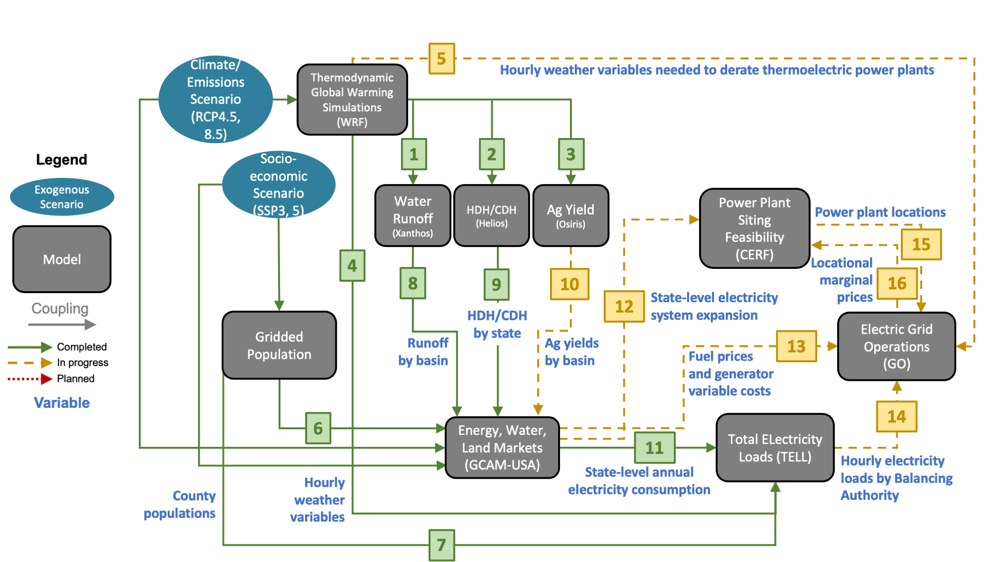

# End-to-End Demonstration of Exp. Group B Workflow

## Summary
We are now at the stage where it is possible to conduct an end-to-end demonstration of the models and model couplings
required for IM3 Exp. Group B experiments. This metarepository is meant to be a landing place for that
demonstration. The basic idea is that we should work off of the wiring diagram below and actually go through
the process of connecting the models together. At this stage all the component models are producing at least sample
output datasets. Those sample outputs are sufficient for this demonstration as the purpose is to understand which
couplings and data passes are complete or at least have been tested and which still need more development.

  

For the sake of the demonstration we will use the RCP 8.5 "hotter" climate forcing with the SSP5 socioeconomic
forcing: rcp85hotter_ssp5. Please use this scenario name in your output directories. If you are passing sample data
that is not from the rcp85hotter_ssp5 scenario then just label your output directory "sample_data". If your model only
runs for a single year then use the year 2030 for testing.

Please store your data for this demonstration on PNNL's Institutional Computing (PIC) at: `/pic/projects/im3/exp_group_b_test`

## Legend
🟢 = Completed  
🟡 = In progress  
🔴 = Planned

## Contributing models
| Model | Status | Version | Model Source Code |
|:-:|:-:|:-:|:--|
| WRF | 🟢 | v4.2.1 | [Code](https://github.com/IMMM-SFA/wrf_historical) |
| Population | 🟡 | TBD | TBD |
| Xanthos | 🟡 | v2.4.1 | [Code](https://github.com/JGCRI/xanthos) |
| Helios | 🟡 | v1.0.0 | TBD |
| Osiris | 🟡 | TBD | [Code](https://github.com/JGCRI/osiris) |
| GCAM-USA | 🟡 | v5.3 | [Code](https://stash.pnnl.gov/projects/JGCRI/repos/gcam-core/browse?at=refs%2Fheads%2Fzk%2Ffeature%2Fgcam-usa-im3) |
| TELL | 🟡 | v1.0 | [Code](https://github.com/IMMM-SFA/tell) |
| CERF | 🟡 | v2.0.9 | [Code](https://github.com/IMMM-SFA/cerf) |
| GO | 🟡 | TBD | TBD |

## Forcing data
For this demonstration we'll use the IM3 WRF and population dynamics runs for the rcp85hotter_ssp5 scenario. Details
about the forcing data are provided in the table below.

| Type | Status | Platform | Years | Directory | Documentation |
|:-:|:-:|:-:|:-:|:--|:--|
| Climate | 🟢 | NERSC | 2020-2059 | /global/cfs/cdirs/m2702/gsharing/CONUS_TGW_WRF_SSP585_HOT_NEAR | [Documentation](https://immm-sfa.atlassian.net/wiki/spaces/IP/pages/1979809807/Accessing+Historical+and+Future+IM3+Climate+Forcing) |
| Climate | 🟢 | NERSC | 2060-2099 | /global/cfs/cdirs/m2702/gsharing/CONUS_TGW_WRF_SSP585_HOT_FAR | [Documentation](https://immm-sfa.atlassian.net/wiki/spaces/IP/pages/1979809807/Accessing+Historical+and+Future+IM3+Climate+Forcing) |
| Population | 🟢 | PIC | 2020-2100 | /pic/projects/im3/exp_group_b_test/forcing_data/population | TBD |

## Model coupling
| # | From/To | Status | Component Code | Directory | Documentation |
|:-:|:-:|:-:|:-:|:--|:-:|
| 1  | wrf_to_xanthos | 🟡 | TBD | /global/cfs/cdirs/m2702/gcamusa/wrf_to_xanthos | [Documentation](https://immm-sfa.github.io/khan-etal_2022_im3gcamusa/) |
| 2  | wrf_to_helios | 🟡 | TBD | TBD | [Documentation](https://immm-sfa.github.io/khan-etal_2022_im3gcamusa/) |
| 3  | wrf_to_osiris | 🟡 | TBD | TBD | [Documentation](https://immm-sfa.github.io/khan-etal_2022_im3gcamusa/) |
| 4  | wrf_to_tell | 🟢 | [Code](https://github.com/IMMM-SFA/im3components/tree/main/im3components/wrf_to_tell) | /pic/projects/im3/exp_group_b_test/forcing_data/wrf_to_tell/wrf_tell_bas_output/rcp85hotter_ssp5 | [Documentation](https://github.com/IMMM-SFA/im3components/tree/main/im3components/wrf_to_tell) |
| 5  | wrf_to_go | 🔴 | TBD | TBD | TBD |
| 6  | pop_to_gcamusa | 🟢 | TBD | TBD | TBD |
| 7  | pop_to_tell | 🟢 | TBD | /pic/projects/im3/exp_group_b_test/forcing_data/population | TBD |
| 8  | xanthos_to_gcamusa | 🟡 | TBD | TBD | TBD |
| 9  | helios_to_gcamusa | 🟡 | TBD | TBD | TBD |
| 10 | osiris_to_gcamusa | 🟡 | TBD | TBD | TBD |
| 11 | gcamusa_to_tell | 🟢 | TBD | /pic/projects/im3/exp_group_b_test/output_data/gcamusa/sample_output | TBD |
| 12 | gcamusa_to_cerf | 🟡 | TBD | /pic/projects/im3/gcamusa/diagnostics/outputs_CERF | [Documentation](https://immm-sfa.atlassian.net/wiki/spaces/IP/pages/2318925866/GCAM-USA+Inputs+to+CERF) |
| 13 | gcamusa_to_go | 🔴 | TBD | TBD | TBD |
| 14 | tell_to_go | 🟡 | TBD | /pic/projects/im3/exp_group_b_test/output_data/tell/sample_output | TBD |
| 15 | cerf_to_go | 🟡 | TBD | /pic/projects/im3/exp_group_b_test/output_data/cerf/sample_output | [Documentation](https://immm-sfa.atlassian.net/wiki/spaces/IP/pages/2322333697/CERF+Outputs) |
| 16 | go_to_cerf | 🔴 | TBD | TBD | TBD |
