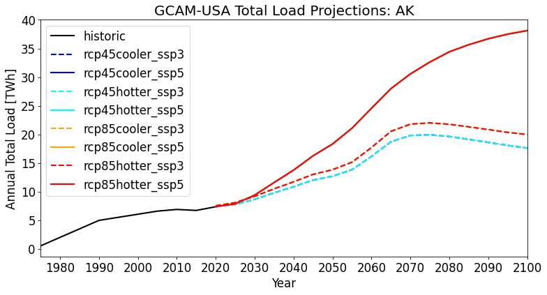
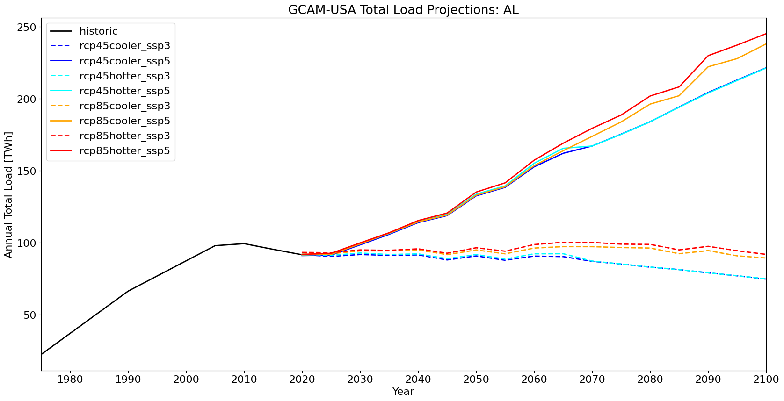
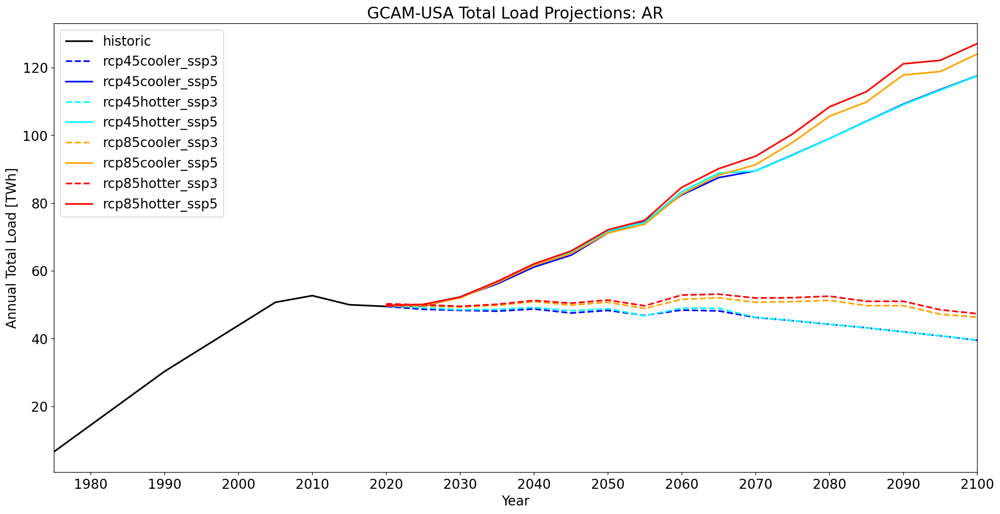
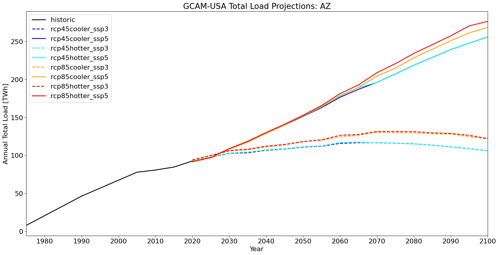

# Quickview Analysis of Total Load Projections
>
## Purpose
This analysis looks at the evolution of annual total demand for electricity for each state and Balancing Authority (BA) 
by the GCAM-USA and TELL models. Total loads are analyzed across the eight IM3 socioeconomic and climate scnearios.
>
## Notes
>
1. TBD
>
## State Analyses
>
| Name | Total Load |
| :-: | :-: |
| Alaska |  |
| Alabama |  |
| Arkansas |  |
| Arizona |  |
| California | [Plot](plots/total_load/CA_Load_Projections.png) |
| Colorado | [Plot](plots/total_load/CO_Load_Projections.png) |
| Connecticut | [Plot](plots/total_load/CT_Load_Projections.png) |
| District of Columbia | [Plot](plots/total_load/DC_Load_Projections.png) |
| Delaware | [Plot](plots/total_load/DE_Load_Projections.png) |
| Florida | [Plot](plots/total_load/FL_Load_Projections.png) |
| Georgia | [Plot](plots/total_load/GA_Load_Projections.png) |
| Hawaii | [Plot](plots/total_load/HI_Load_Projections.png) |
| Iowa | [Plot](plots/total_load/IA_Load_Projections.png) |
| Idaho | [Plot](plots/total_load/ID_Load_Projections.png) |
| Illinois | [Plot](plots/total_load/IL_Load_Projections.png) |
| Indiana | [Plot](plots/total_load/IN_Load_Projections.png) |
| Kansas | [Plot](plots/total_load/KS_Load_Projections.png) |
| Kentucky | [Plot](plots/total_load/KY_Load_Projections.png) |
| Louisiana | [Plot](plots/total_load/LA_Load_Projections.png) |
| Massachusetts | [Plot](plots/total_load/MA_Load_Projections.png) |
| Maryland | [Plot](plots/total_load/MD_Load_Projections.png) |
| Maine | [Plot](plots/total_load/ME_Load_Projections.png) |
| Michigan | [Plot](plots/total_load/MI_Load_Projections.png) |
| Minnesota | [Plot](plots/total_load/MN_Load_Projections.png) |
| Missouri | [Plot](plots/total_load/MO_Load_Projections.png) |
| Mississippi | [Plot](plots/total_load/MS_Load_Projections.png) |
| Montana | [Plot](plots/total_load/MT_Load_Projections.png) |
| North Carolina | [Plot](plots/total_load/NC_Load_Projections.png) |
| North Dakota | [Plot](plots/total_load/ND_Load_Projections.png) |
| Nebraska | [Plot](plots/total_load/NE_Load_Projections.png) |
| New Hampshire | [Plot](plots/total_load/NH_Load_Projections.png) |
| New Jersey | [Plot](plots/total_load/NJ_Load_Projections.png) |
| New Mexico | [Plot](plots/total_load/NM_Load_Projections.png) |
| Nevada | [Plot](plots/total_load/NV_Load_Projections.png) |
| New York | [Plot](plots/total_load/NY_Load_Projections.png) |
| Ohio | [Plot](plots/total_load/OH_Load_Projections.png) |
| Oklahoma | [Plot](plots/total_load/OK_Load_Projections.png) |
| Oregon | [Plot](plots/total_load/OR_Load_Projections.png) |
| Pennsylvania | [Plot](plots/total_load/PA_Load_Projections.png) |
| Rhode Island | [Plot](plots/total_load/RI_Load_Projections.png) |
| South Carolina | [Plot](plots/total_load/SC_Load_Projections.png) |
| South Dakota | [Plot](plots/total_load/SD_Load_Projections.png) |
| Tennessee | [Plot](plots/total_load/TN_Load_Projections.png) |
| Texas | [Plot](plots/total_load/TX_Load_Projections.png) |
| Utah | [Plot](plots/total_load/UT_Load_Projections.png) |
| Virginia | [Plot](plots/total_load/VA_Load_Projections.png) |
| Vermont | [Plot](plots/total_load/VT_Load_Projections.png) |
| Washington | [Plot](plots/total_load/WA_Load_Projections.png) |
| Wisconsin | [Plot](plots/total_load/WI_Load_Projections.png) |
| West Virginia | [Plot](plots/total_load/WV_Load_Projections.png) |
| Wyoming | [Plot](plots/total_load/WY_Load_Projections.png) |
